# Application Flow Document

## **Primer — AI-Powered Digital Public Safety Intelligence Platform**

| Field | Detail |
|---|---|
| **Document Version** | 2.0 — Hackathon MVP |
| **Date** | 5 July 2026 |
| **Companion Documents** | [PRD](product_requirements_document.md) · [TRD](technical_requirements_document.md) |

---

## 1. Platform Entry Points

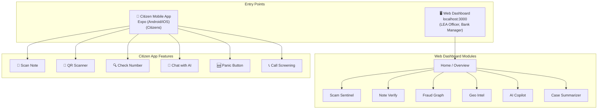

---

## 2. Demo Roles & Access

| Screen | Yashi (LEA Officer) | Srinivas (Bank Manager) | Sumanth (Citizen) |
|---|---|---|---|
| Home Dashboard | ✅ Full | ✅ Limited | ❌ |
| Scam Sentinel | ✅ Full | ❌ | ❌ |
| Note Verify | ✅ Analytics | ✅ Full (scan + history) | ❌ |
| Fraud Graph | ✅ Full | ❌ | ❌ |
| Geo Intel | ✅ Full | ❌ | ❌ |
| AI Copilot | ✅ Full | ❌ | ❌ |
| Case Summarizer | ✅ Full | ❌ | ❌ |
| Mobile App | ❌ | ❌ | ✅ Full |

---

## 3. Authentication Flow

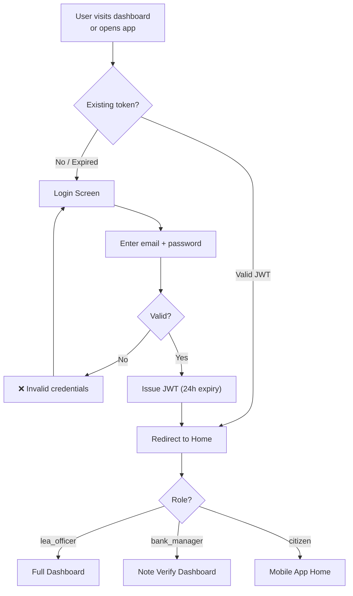

No MFA, no onboarding wizard, no account lockout for MVP.

---

## 4. Flow 1 — Home Dashboard (LEA Officer)

```
┌──────────────────────────────────────────────────────────────────────┐
│  🛡️ Primer     [🔍 Search number, account...]     [🔔 3]  [👤 Yashi]│
├────────────┬─────────────────────────────────────────────────────────┤
│            │                                                         │
│  📊 Home ● │  Good Morning, Yashi                                   │
│            │  Mumbai Suburban Cyber Cell · Last 24 hours             │
│  🚨 Scam   │                                                        │
│  Sentinel  │  ┌─────────┬─────────┬─────────┬─────────┐            │
│            │  │ 🚨 47   │ 💵 12   │ 🕸️ 3    │ 📍 891  │            │
│  💵 Note   │  │ Active  │ FICN    │ Fraud   │ Total   │            │
│  Verify    │  │ Scam    │ Flagged │ Clusters│ Incidents│           │
│            │  │ Alerts  │ Today   │ Found   │ (24h)   │            │
│  🕸️ Fraud  │  └─────────┴─────────┴─────────┴─────────┘            │
│  Graph     │                                                         │
│            │  ┌────────────────────────────────────────────┐         │
│  🗺️ Geo    │  │  📊 THREAT LEVEL: ELEVATED                │         │
│  Intel     │  │  ▰▰▰▰▰▰▰▰▱▱  78/100                     │         │
│            │  │  Primary driver: Digital arrest scam surge │         │
│  🤖 AI     │  └────────────────────────────────────────────┘         │
│  Copilot   │                                                         │
│            │  ┌──────────────────┐  ┌──────────────────────┐        │
│  📋 Case   │  │  LIVE ALERT FEED │  │  CRIME MAP (MINI)    │        │
│  Summary   │  │  ────────────────│  │  [Interactive Map]    │        │
│            │  │  🔴 14:23 RED    │  │  [Open Full Map →]   │        │
│            │  │  Digital arrest  │  └──────────────────────┘        │
│            │  │  +91-98XX..      │                                   │
│            │  │  [View Details]  │                                   │
│            │  └──────────────────┘                                   │
└────────────┴─────────────────────────────────────────────────────────┘
```

---

## 5. Flow 2 — Scam Sentinel (Live Monitor)

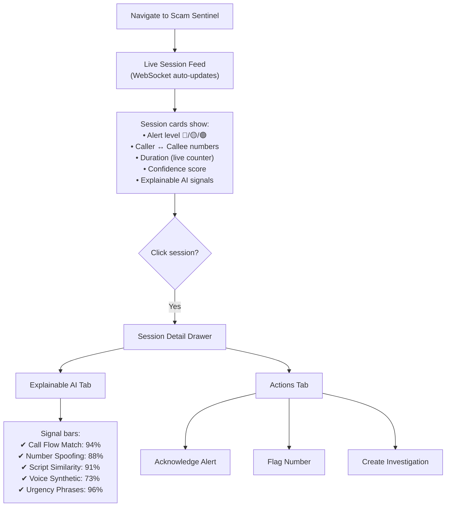

### Scam Session Detail Screen

```
┌──────────────────────────────────────────────────────────────────────┐
│  ← Back to Live Monitor                                             │
│                                                                      │
│  Session: SSN-2026-07-05-14234                    Status: 🔴 ACTIVE │
│                                                                      │
│  Caller: +91-9876-XXXXX4 (Spoofed ⚠️)    Callee: +91-7890-XXXXX7  │
│  Duration: 00:15:22 (live)                                           │
│                                                                      │
│  EXPLAINABLE AI — WHY THIS WAS FLAGGED               CONFIDENCE     │
│  ─────────────────────────────────────              ┌────────────┐  │
│                                                      │   91.5%    │  │
│  ✔ Call Flow Match        ▰▰▰▰▰▰▰▰▰▱  94%         │   HIGH     │  │
│    "Matches digital arrest pattern (CBI variant)"    │   RISK     │  │
│                                                      └────────────┘  │
│  ✔ Number Spoofing        ▰▰▰▰▰▰▰▰▱▱  88%                        │
│    "CLI mismatch: presented as +91, origin Myanmar"                  │
│                                                                      │
│  ✔ Script Similarity      ▰▰▰▰▰▰▰▰▰▱  91%                        │
│    "Matches template #47 — seen 240 times"                           │
│                                                                      │
│  ⚠️ Deepfake Voice        ▰▰▰▰▰▰▰▱▱▱  73%                        │
│    "Spectral anomalies in 2-4kHz; possible AI synthesis"             │
│                                                                      │
│  ✔ Urgency Phrases        ▰▰▰▰▰▰▰▰▰▰  96%                        │
│    "Detected: arrest warrant, immediate transfer, FIR"               │
│                                                                      │
│  ┌──────────────┐ ┌──────────────┐ ┌──────────────┐                │
│  │ ✅ Acknowledge│ │ 🚫 Flag     │ │ 📋 Create    │                │
│  │              │ │ Number       │ │ Investigation│                │
│  └──────────────┘ └──────────────┘ └──────────────┘                │
└──────────────────────────────────────────────────────────────────────┘
```

---

## 6. Flow 3 — Note Verify (Currency Scanner)

### 6.1 Mobile App — Scan Flow

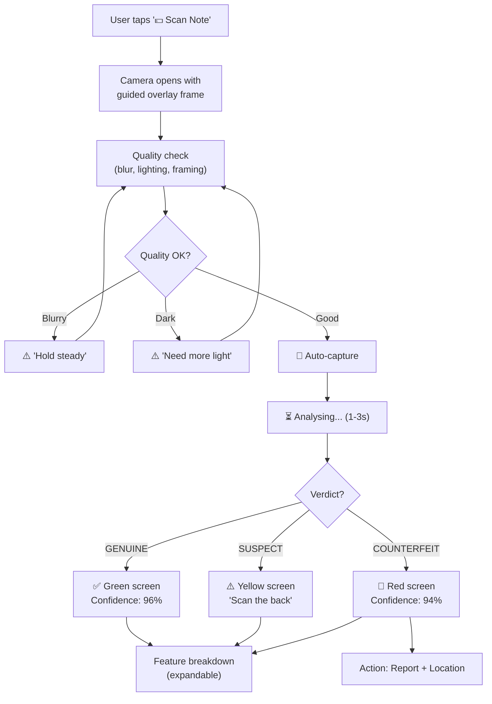

### 6.2 Result Screen

```
┌─────────────────────────────────────┐
│  ← Scan Result                      │
│                                      │
│  ┌─────────────────────────────────┐ │
│  │  [Annotated note image with    │ │
│  │   problem areas highlighted]   │ │
│  └─────────────────────────────────┘ │
│                                      │
│  ┌─────────────────────────────────┐ │
│  │  🚫  COUNTERFEIT DETECTED       │ │
│  │  Denomination: ₹500             │ │
│  │  Confidence: 94.2%              │ │
│  │  Serial: 2AB 012345             │ │
│  │  ⚠️ Known in counterfeit DB    │ │
│  └─────────────────────────────────┘ │
│                                      │
│  Feature Analysis               [▾] │
│  ✅ Watermark         Pass  98%      │
│  ✅ Security Thread   Pass  95%      │
│  ❌ Microprint        FAIL  23%      │
│  ✅ Intaglio Print    Pass  91%      │
│  ⚠️ Colour Shift     Warn  61%      │
│  ❌ Serial Number     Known FICN     │
│                                      │
│  ┌──────────┐  ┌──────────────────┐  │
│  │ 📸 Scan  │  │ 📍 Report This   │  │
│  │ Back     │  │ Note             │  │
│  └──────────┘  └──────────────────┘  │
└─────────────────────────────────────┘
```

---

## 7. Flow 4 — Fraud Graph Explorer

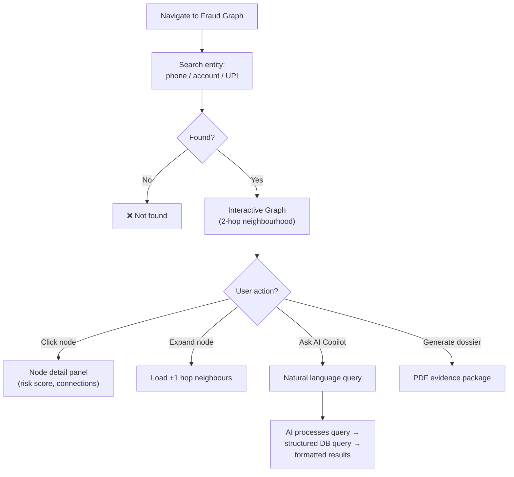

### Graph Explorer Screen

```
┌──────────────────────────────────────────────────────────────────────┐
│  Fraud Graph > Explorer                                              │
│  Search: [+91-9876543210       🔍]  Depth: [2 hops ▾]              │
│                                                                      │
│  ┌────────────────────────────────────────┬───────────────────────┐  │
│  │                                        │  ENTITY DETAIL        │  │
│  │       INTERACTIVE GRAPH CANVAS        │  ──────────────        │  │
│  │                                        │                       │  │
│  │            ●━━━●                       │  📱 +91-9876543210    │  │
│  │           ╱     ╲                      │  Risk: 🔴 92/100     │  │
│  │         ●        ●━━━●                 │  Flags: 14            │  │
│  │        ╱╲       ╱    ╲                 │  Cluster: CL-0891     │  │
│  │      ●   ●    ●       ●                │                       │  │
│  │                                        │  Connections:          │  │
│  │  Legend:                               │  • 8 accounts          │  │
│  │  ● Phone  ● Account  ● Person         │  • 23 calls            │  │
│  │  ━ Called  ━ Transferred  ━ Uses       │  • 3 devices           │  │
│  │                                        │                       │  │
│  │  [Zoom +] [Zoom -] [Fit] [Layout ▾]  │  [🕸️ Expand]         │  │
│  │                                        │  [📋 Add to Case]    │  │
│  │                                        │  [📄 Generate Dossier]│  │
│  └────────────────────────────────────────┴───────────────────────┘  │
│                                                                      │
│  ┌──────────────────────────────────────────────────────────────────┐│
│  │  🤖 AI Copilot: "Show all complaints linked to this UPI"       ││
│  │  ──────────────────────────────────────────────                  ││
│  │  Found 7 complaints linked to xyz@ybl:                          ││
│  │  • NCRP-2026-4421 (₹2.3L, digital arrest, 2026-06-28)         ││
│  │  • NCRP-2026-4398 (₹1.1L, digital arrest, 2026-06-25)         ││
│  │  • ... [View All]                                                ││
│  └──────────────────────────────────────────────────────────────────┘│
└──────────────────────────────────────────────────────────────────────┘
```

---

## 8. Flow 5 — Geo Intel (Crime Map)

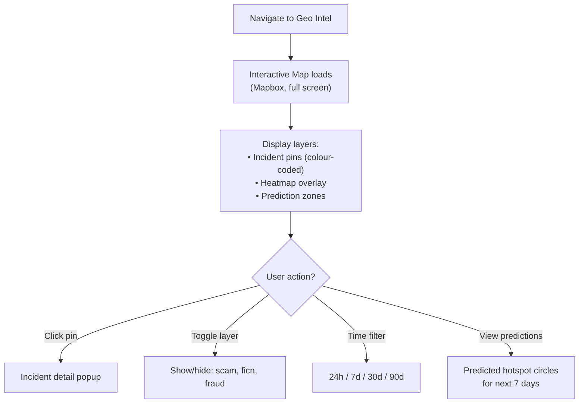

---

## 9. Flow 6 — AI Investigation Copilot

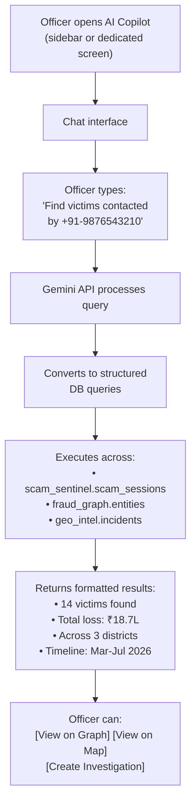

---

## 10. Flow 7 — QR Code Scanner (Citizen App)

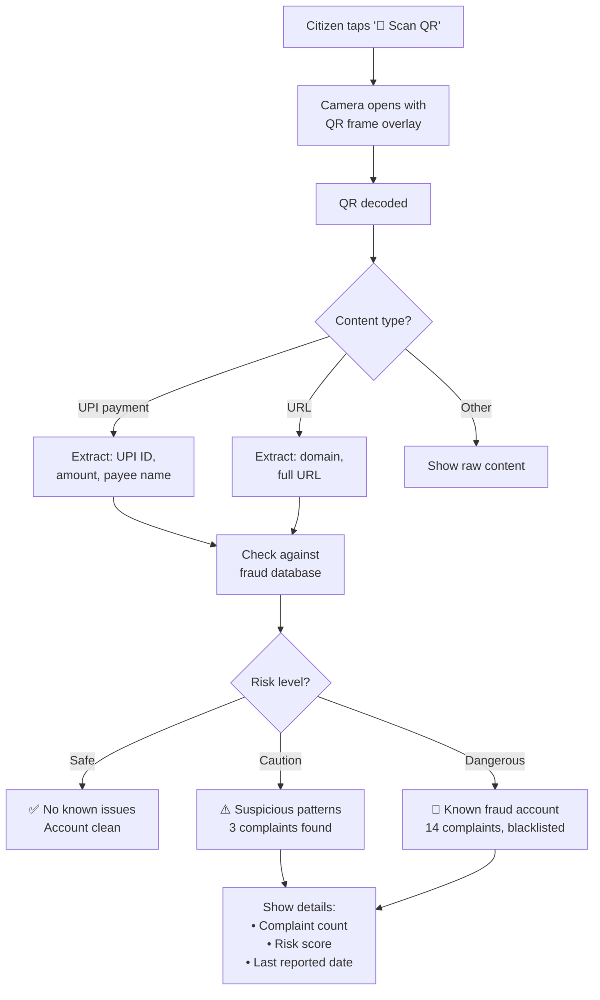

### QR Scan Result Screen

```
┌─────────────────────────────────────┐
│  ← QR Scan Result                    │
│                                      │
│  ┌─────────────────────────────────┐ │
│  │  🚫  DANGEROUS                   │ │
│  │  ───────────────                 │ │
│  │  UPI: fraud@ybl                  │ │
│  │  Payee: "Government Fine Dept"   │ │
│  │  Amount: ₹49,999                 │ │
│  └─────────────────────────────────┘ │
│                                      │
│  Risk Assessment:                    │
│  • 14 fraud complaints filed         │
│  • Account blacklisted since Jun 12  │
│  • Linked to digital arrest scam     │
│  • Risk Score: 96/100                │
│                                      │
│  ┌──────────────────────────────────┐│
│  │  🚫  DO NOT PAY                  ││
│  │  This is a known fraud account   ││
│  └──────────────────────────────────┘│
│                                      │
│  ┌──────────┐  ┌──────────────────┐  │
│  │ Report   │  │ 📞 Call 1930     │  │
│  │ This QR  │  │ (Helpline)       │  │
│  └──────────┘  └──────────────────┘  │
└─────────────────────────────────────┘
```

---

## 11. Flow 8 — Panic Button (Silent SOS)

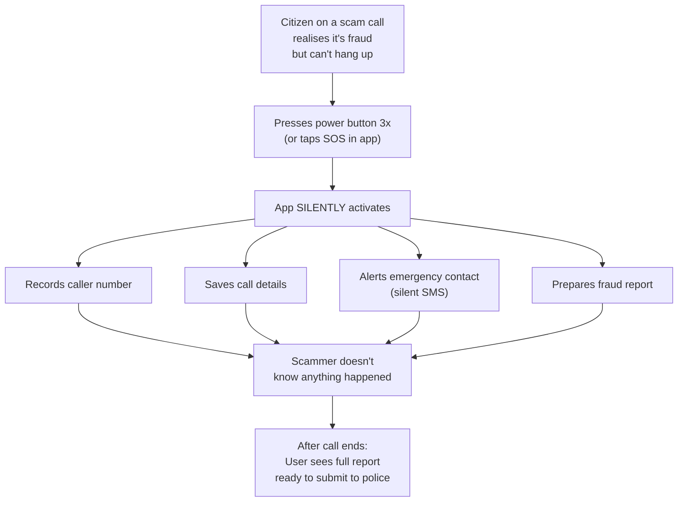

### Panic Activation Screen (Invisible to Scammer)

```
┌─────────────────────────────────────┐
│                                      │
│  [Normal phone screen — no visible   │
│   indication to the caller]          │
│                                      │
│  ─── Background Actions ───          │
│  ✅ Number recorded: +91-9876543210  │
│  ✅ Call details saved               │
│  ✅ Emergency contact notified       │
│  ✅ Fraud report prepared            │
│                                      │
│  [After call ends, notification:]    │
│                                      │
│  ┌─────────────────────────────────┐ │
│  │  🛡️ Primer Protected You        │ │
│  │                                  │ │
│  │  Your SOS was activated during  │ │
│  │  the call. We've prepared a     │ │
│  │  fraud report.                  │ │
│  │                                  │ │
│  │  [View Report] [Submit to 1930] │ │
│  └─────────────────────────────────┘ │
└─────────────────────────────────────┘
```

---

## 12. Flow 9 — Pre-Answer Call Screening

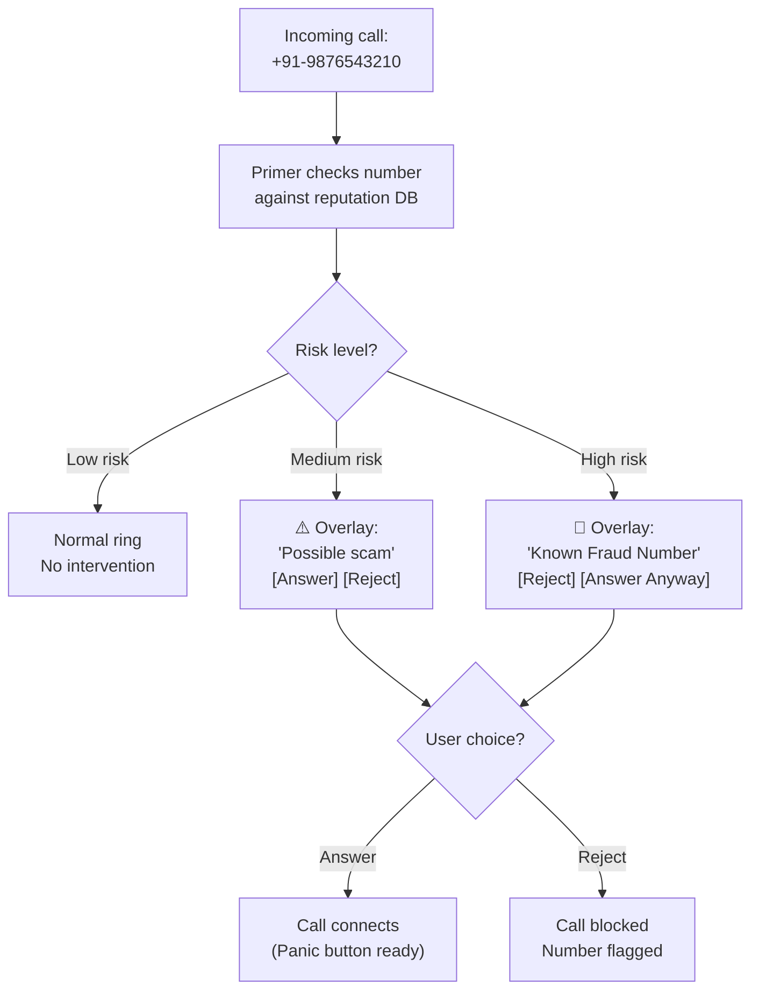

### Call Screening Overlay

```
┌─────────────────────────────────────┐
│                                      │
│           Incoming Call              │
│                                      │
│         9876543210                    │
│                                      │
│         Checking...                  │
│                                      │
│  ┌─────────────────────────────────┐ │
│  │  ⚠️ HIGH SCAM RISK              │ │
│  │  ─────────────────               │ │
│  │  Known Fraud Number              │ │
│  │  • 14 complaints filed           │ │
│  │  • Linked to digital arrest scam │ │
│  │  • Risk Score: 92/100            │ │
│  └─────────────────────────────────┘ │
│                                      │
│  ┌──────────┐  ┌──────────────────┐  │
│  │  🚫      │  │  📞 Answer       │  │
│  │  Reject  │  │  Anyway          │  │
│  └──────────┘  └──────────────────┘  │
└─────────────────────────────────────┘
```

---

## 13. Flow 10 — AI Case Summarizer

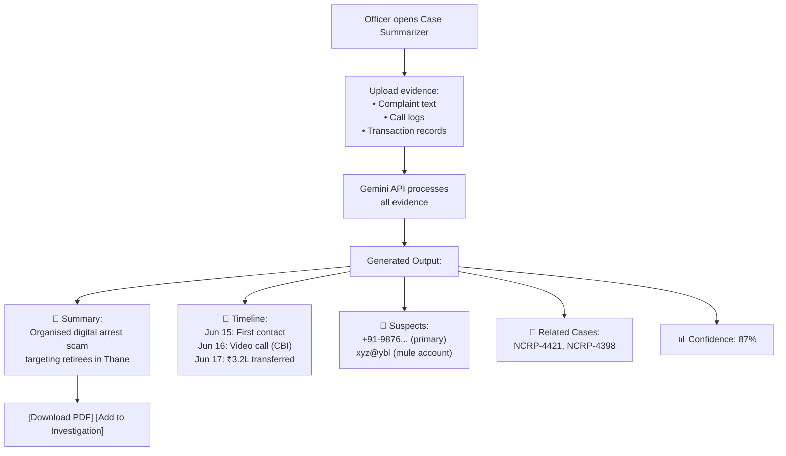

---

## 14. Demo Walkthrough Script (5 minutes)

This is the recommended demo flow for judges:

```
Minute 0:00 — Login as Yashi (LEA Officer)
  → Dashboard with live stats, threat level, mini map

Minute 0:30 — Scam Sentinel
  → Show live RED alert → click → Explainable AI breakdown
  → "This is WHY we flagged it" — signal bars with explanations

Minute 1:30 — AI Copilot
  → Type: "Find all victims contacted by +91-9876543210"
  → Show cross-module results

Minute 2:00 — Fraud Graph
  → Click through to graph → show fraud ring cluster
  → Generate evidence dossier

Minute 2:30 — Geo Intel
  → Show crime heatmap → prediction layer

Minute 3:00 — Switch to Sumanth (Citizen App)
  → QR Scanner: scan a fraudulent QR → show 🚫 DANGEROUS
  → Note Scanner: scan a counterfeit → show 🚫 COUNTERFEIT with features
  → Pre-Answer Call Screening: incoming call → HIGH RISK overlay

Minute 4:00 — Panic Button
  → Simulate: on a scam call → SOS triggered silently
  → Show generated fraud report

Minute 4:30 — Case Summarizer (back to Yashi)
  → Upload evidence → AI generates summary + timeline + suspects

Minute 5:00 — Closing
  → "Primer: From reactive to predictive. Real-time. Explainable. India-first."
```
